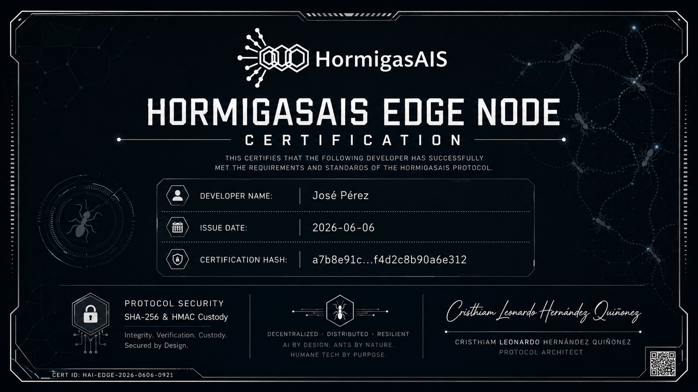

# 🐜 HormigasAIS - Nodo Demo Auditoría

Infraestructura de inteligencia distribuida y soberana basada en el principio de la "Colonia de Hormigas". Este repositorio proporciona un entorno de pruebas aislado para validar la arquitectura de seguridad y el flujo de trabajo del protocolo LBH (Lenguaje Binario HormigasAIS).

## 🚀 Despliegue Automatizado
Hemos simplificado la puesta en marcha para permitir una evaluación técnica inmediata. El script de instalación configurará automáticamente los permisos y la estructura de directorios necesaria.

Ejecute el siguiente comando en su terminal:
bash install.sh

## 🔐 Arquitectura de Seguridad (Zero Trust)
El sistema implementa una gestión de accesos por roles (RBAC) diseñada para confinar a cada usuario a su función específica, garantizando la integridad de la lógica soberana.

| Rol | Portal de Acceso | Capacidad |
| :--- | :--- | :--- |
| Auditor | ./portal_auditor.sh | Validación de red e inyección de feromonas |
| Estudiante | ./portal_estudiante.sh | Observación de estado (Solo lectura) |

## 🛠 Instrucciones de Uso
1. Configuración: Asegúrese de estar en el directorio raíz del proyecto.
2. Ejecución: Inicie el portal correspondiente según su rol autorizado.
3. Validación: El sistema solicitará un Token de Acceso. Tras una validación exitosa, el sistema ejecutará la tarea y cerrará la sesión automáticamente para preservar la seguridad.

## 🔑 Credenciales de Prueba
Para realizar la auditoría, utilice el siguiente token:
AUDITOR_TEST_KEY_2026

---
*Proyecto desarrollado por HormigasAIS - Infraestructura soberana para Edge Computing.*

---

## 🏆 Certificado de Completacion — Protocolo LBH

Al completar el reto, sella tu solucion en [hormigasais.com](https://hormigasais.com) y recibe un certificado como este:

| Campo | Detalle |
|---|---|
| **Firma LBH** | `CLHQ-NVR5WWAS` unica e irrepetible |
| **SHA-256** | Hash del activo sellado |
| **HMAC** | Prueba criptografica de integridad |
| **Nodo emisor** | A16-SanMiguel-SV |
| **Verificacion** | Publica en [hormigasais.com](https://hormigasais.com) → 🔍 Verificar |

> A diferencia de certificados tradicionales en PDF, este es **descentralizado y verificable sin intermediarios** — cualquier persona confirma su autenticidad sin pedirle permiso a nadie.

**Desafio:** Sella tu fork del reto como activo digital y comparte tu firma `CLHQ-XXXXXXXX` en los comentarios del tutorial de Platzi.
